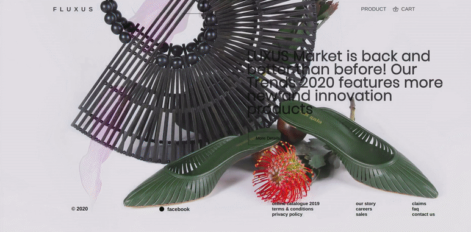

## App in progress

~~No copyright infringement intended, All pictures used in this exercise are **_only_** for educational purposes.~~

<br>
<br>

<p>This project marked the end of the REACT courses in DCI school, few weeks after that i felt curious about integrating firebase to the original project.</p>

<br>
<br>


<br>
<br>

<h2>First Step</h2>

<p>Adding the FRONTEND part (react + scss) styles </p>
<p>JUN 30/2020 </p>

[](https://github.com/nadiamariduena/react-router-intro-dci)

<br>
<br>
<hr>
<br>
<br>

### AFTER FEW MONTHS OF TAKING CARE OF OTHER PROJECTS , I DECIDED TO UPDATE THE FLUXUS SHOP.

<p>REPLACING the images and the animation </p>
<p>DEC 08/2020 </p>

<br>

##### IF YOU HAVE A PROBLEM WHEN TRYING TO VISUALIZE THE PROJECT with NPM START

- IF the error is related to the binding

- DELETE the node modules and the package lock json and proceed to type npm install again, so to install all the dependencies and get a new node modules

<br>
<br>

### 🌻 🌻 🌻 NEW IMAGES 📷 🌻 🌻 🌻

<br>

##### I DECIDED TO CHANGE ALL THE IMAGES I DIDN'T HAVE THE RIGHT TO USE, for incredible free images from also talented photographers

<br>

##### ALL THE NEW IMAGES BELONG TO:

- Trình Minh Thư , She is a multi disciplinary artist from Vietnam

[Trình Minh Thư on unsplash](https://unsplash.com/@imdauphong)

[Trình Minh Thư on behance](https://www.behance.net/imdauphong)

<br>

##### PREVIEW OF THE SHOP

[](https://nadiamariduena.github.io/fluxushome-shop/)

<br>
<br>

### ANIMATION 🏃

##### I REPLACED THE ANIMATION

- I am still not glad with it but i think i am going to leave like so for this project, as i will be focused more in the backend.

```css
/************* BEFORE **************/
  background-image: url(../img-decor/ignant-design-ligne-roset-daybed-001--720x325.jpg);
  background-position: center right;
  background-size: 150%;
  transition: 6s ease;
 &:hover {
    background-position: left bottom;
    background-size: 110%;
    background-image: url(../img-decor/OS---OOS_private-residence-3.jpg);


/************* AFTER **************/
.home-banner {
  width: 100vw;
  height: 100vh;

  display: flex;
  flex-direction: column;
  background-image: url(../img-shop/frontshop5_by_Trình-Minh-Thư.jpg);
  background-position: right bottom 14%;
  background-size: cover;
  animation-delay: -2s;
  animation: mymove 9s infinite alternate-reverse ease-in-out;
  background-repeat: no-repeat;
  position: relative;

  // &:hover {
  //   background-position: right bottom 14%;
  //   background-size: cover;
  //   background-image: url(../img-shop/frontshop3_by_Trình-Minh-Thư.jpg);
  // }

  @keyframes mymove {
    0% {
      background-image: url(../img-shop/frontshop5_by_Trình-Minh-Thư.jpg);
    }
    25% {
      background-image: url(../img-shop/frontshop4_by_Trình-Minh-Thư.jpg);
    }
    50% {
      background-image: url(../img-shop/frontshop10_by_Trình-Minh-Thư.jpg);
    }
    100% {
      background-image: url(../img-shop/frontshop11_by_Trình-Minh-Thư.jpg);
    }
  }

```

<br>
<br>
<hr>
<br>
<br>

## Second Step (in progress) 🍰

<p>Adding the BACKEND part (react + firebase or MONGO) login system  </p>
